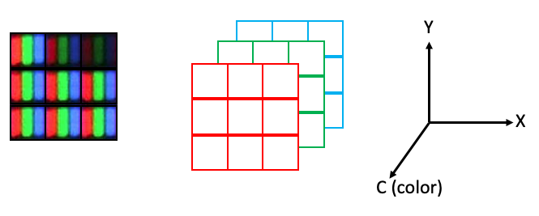
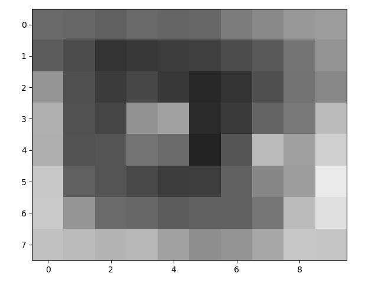

# Part 1: Images are Arrays

## A quick review of arrays

Digital images are represented as numeric arrays, so lets begin with a quick review. In Python (NumPy, specifically), arrays are data structures that consist of collections of items of the same type. Each item in the collection has a unique location with respect to an N-dimensional grid. These locations are zero-indexed, so the "first" item along an axis has index `0`.


In the 1D case above, there are three items (integers, in this example) of index `0`, `1`, and `2`. In the 2D case, the item in the red box has the index `(1,2)`. Note that NumPy conventions dictate that indexing works like `(row, column)`.

Once you go beyond two dimensions, ordering of dimensions becomes somewhat arbitrary, and different packages/software will use different conventions for how arrays are ordered. We will use the conventions of [scikit-image](https://scikit-image.org/) for indexing.

3D arrays use `(plane, row, column)` ordering:


4D arrays are little harder to visualize, but you can think of 4D arrays as a time series of 3D arrays, with dimensions ordered as `(time, plane, row, column)`:


Now lets go through some examples of "adjacent" positions in the array and what they would look like with respect to their index. The most straightforward example would be two positions in the same plane at the same time:


However, two positions may also be adjacent with a step along the depth axis:


Or a step along the time axis:


## Images as 2D (grayscale) or 3D (2D color) arrays

The simplest image to work with is a grayscale image. These are represented as 2D arrays, where each position in the array corresponds to a single pixel. Brighter (whiter) parts of the image are represented by larger values, and darker parts of the image are represented by smaller values. The values themselves may differ with respect to type.

It might be useful at this point to review [numpy data types](https://docs.scipy.org/doc/numpy-1.16.1/reference/arrays.scalars.html#built-in-scalar-types).

The most common types you will encounter are:

* uint8 - integers between 0-255
* uint16 - integers between 0-65,535
* float64(or double) - floating point numbers, e.g., 1.45643, 5.0, 1.23435e9

`scikit-image` functions will usually output float64 values, regardless of which data type you start with, but these can usually be safely converted back to the original type.

In the following parrot image, values are `uint8` and thus range from 0-255:


Notice how the brightest pixel is 255, and the darker pixels have much lower values.

Color images are conceptually similar, except each "pixel" has three values, corresponding a a red, green and blue value. Consider the clown image below:


Because human photoreceptors are tuned to red, green, and blue wavelengths, all of the colors we can see can be represented as a combination of red, green, and blue light. Thus if you were to look at your monitor under a microscope, you would notice the the clown image is actually composed of an array of tightly packed red, green and blue elements. Hence each pixel has a red, green, and blue value:


However, arrays can only hold one value per position. So 2D color images actually need to be represented as 3D arrays, where each plane in the color dimension (channel) represents a different color:



In `scikit-image`, the indexing convention for color images is `(row, column, channel)`, where the three colors are represented as three channels, with the ordering `{0: 'red', 1: 'green', 2: 'blue'}`.

The maximum number of dimensions we usually have to deal with in image analysis is five: time, plane (z axis), row (y axis), column (x axis), channel. In `scikit-image`, you will often see the ordering stated like this:
`(t, pln, row, col, ch)`.

## Working with 2-D color images

Now let's take a look at using `scikit-image` (abbreviated as `skimage`) to work with a two-dimensional color image. We need to first start with some imports. We will use `numpy` for working with arrays and `skimage` for loading and visualizing image data and performing some basic operations:

```python
>>> import numpy as np
>>> from skimage import data, io
```

`skimage` comes with some example data:

```python
>>> image = data.astronaut()
>>> io.imshow(image);
```


If you are using Jupyter to run your code, a color image of an astronaut should show up in your notebook. If you are using another application, your results may vary (e.g., running `ipython` in a macOS terminal will open your image in a separate window).

So what is the `type` of our image?

```python
>>> type(image)
numpy.ndarray
```

Again, our image is represented as a `numpy` array. If you just call the image, Python will return a snippet. This isn't terribly useful, but can give you a feel for the type of data you are working with:

```python
>>> image
array([[[154, 147, 151],
        [109, 103, 124],
        [ 63,  58, 102],
        ...,
        [127, 120, 115],
        [120, 117, 106],
        [125, 119, 110]],

       [[177, 171, 171],
        [144, 141, 143],
        [113, 114, 124],
        ...,
        [127, 118, 112],
        [124, 115, 108],
        [121, 116, 105]],

       [[201, 194, 193],
        [182, 178, 175],
        [168, 165, 164],
        ...,
        [128, 120, 117],
        [126, 116, 112],
        [124, 114, 109]],

       ...,

       [[186, 170, 176],
        [186, 170, 177],
        [183, 168, 170],
        ...,
        [  0,   0,   0],
        [  0,   0,   1],
        [  0,   0,   0]],

       [[183, 169, 170],
        [182, 167, 171],
        [185, 164, 176],
        ...,
        [  0,   0,   1],
        [  1,   1,   1],
        [  0,   0,   0]],

       [[184, 167, 172],
        [183, 165, 169],
        [180, 162, 171],
        ...,
        [  0,   0,   0],
        [  1,   1,   1],
        [  0,   0,   0]]], dtype=uint8)
```

What is more useful is to look at the values for various array attributes:

Number of dimensions:

```python
>>> image.ndim
3
```

Size along each dimension (axis):

```python
>>> image.shape
(512, 512, 3)
```

Data type of the image (i.e., data type of the pixel values):

```python
>>> image.dtype
dtype('uint8')
```

We can also use any `numpy.ndarray` method:

```python
>>> flat_image = image.flatten()
>>> flat_image.shape
(786432,)
```

And we can use indexing to select just parts of the array:

```python
>>> face = image[0:200, 150:300, 0]
>>> face.shape
(200, 150)
>>> io.imshow(face);
```


Very small arrays are easier to visualize as images:

```python
>>> eye = face[97:105, 49:59]
>>> eye
array([[105, 102,  96, 106, 101, 103, 124, 137, 152, 156],
       [ 92,  75,  51,  57,  61,  63,  76,  90, 116, 147],
       [149,  80,  59,  71,  57,  41,  53,  79, 115, 135],
       [176,  81,  69, 146, 161,  42,  58, 100, 120, 187],
       [174,  83,  85, 116, 107,  35,  85, 186, 159, 207],
       [200,  96,  84,  72,  61,  62,  96, 134, 157, 234],
       [201, 149, 107, 103,  92,  98,  97, 118, 186, 224],
       [192, 186, 180, 183, 161, 142, 148, 167, 198, 197]], dtype=uint8)
>>> io.imshow(eye);
```



You can also return the values for specific pixels with indexing:

```python
>>> eye[2, 2]
59
```

You can return multiple values by providing a tuple or list of coordinates for each axis:

```python
>>> eye[(2, 3), (2, 6)]
array([59, 58], dtype=uint8)
```

In the above example, we asked for the pixel values at `(2, 2)` and `(3, 6)`, which were `59` and `58`, respectively.

To return all of the values along an axis, use `:`, like this:

```python
>>> eye[:, 3]
array([106,  57,  71, 146, 116,  72, 103, 183], dtype=uint8)
```

We can also easily perform math on our `numpy.ndarray`:

```python
>>> eye - 34
array([[ 71,  68,  62,  72,  67,  69,  90, 103, 118, 122],
       [ 58,  41,  17,  23,  27,  29,  42,  56,  82, 113],
       [115,  46,  25,  37,  23,   7,  19,  45,  81, 101],
       [142,  47,  35, 112, 127,   8,  24,  66,  86, 153],
       [140,  49,  51,  82,  73,   1,  51, 152, 125, 173],
       [166,  62,  50,  38,  27,  28,  62, 100, 123, 200],
       [167, 115,  73,  69,  58,  64,  63,  84, 152, 190],
       [158, 152, 146, 149, 127, 108, 114, 133, 164, 163]], dtype=uint8)
```

## Exercises - Part 1

1. Try doing some math with the 'eye' array. What happens when an operation results in a value outside of 0-255?

## More useful attributes and methods of numpy arrays

Arrays have the `.T` attribute, which is the transposed data (transposed = order of dimensions/axes flipped)

```python
>>> print('Normal shape: ', face.shape)
Normal shape:  (200, 150)
>>> print('Transposed shape: ', face.T.shape)
Transposed shape:  (150, 200)
>>> io.imshow(face.T);
```


The next few tips are easier to demonstrate with a smaller array:

```python
>>> a = np.array([[1,2,3],
>>>               [4,5,6],
>>>               [0,0,0]])
```

Note that to construct our array, we gave the `np.array` function a list of lists.

Return the maximum value of the array:

```python
>>> a.max()
6
```

Collapse axis `0` (rows) to max values of each column:

```python
>>> a.max(axis=0)
array([4, 5, 6])
```

Collapse axis `1` (columns) to max values of each row:

```python
>>> a.max(axis=1)
array([3, 6, 0])
```

Return the indices of all nonzero items:

```python
>>> a.nonzero()
(array([0, 0, 0, 1, 1, 1]), array([0, 1, 2, 0, 1, 2]))
```

Note that the function returns an ordered list of row indices and an ordered list of column indices. This makes selecting the values at those indices rather easy:

```python
>>> a[a.nonzero()]
array([1, 2, 3, 4, 5, 6])
```

`numpy.where` is a similarly useful function, except it allows you to return indices that satisfy more complicated conditions (i.e., evaluate to `True`). For example, if we want to return all of the indices of items in array `a` that are `> 3` and `< 6`, we could do this:

```python
>>> np.where((a > 3) & (a < 6))
(array([1, 1]), array([0, 1]))
```

You can combine indexing with `numpy.where()` and assignment to change certain elements of an array. If we want to set all items in array `a` that are `> 3` and `< 6` to 255, we would do this:

```python
>>> a[np.where((a > 3) & (a < 6))] = 255
>>> a
array([[  1,   2,   3],
       [255, 255,   6],
       [  0,   0,   0]])
```

## Exercises - Part 2

1. Display a cropped color image of the [astronaut's](https://en.wikipedia.org/wiki/Eileen_Collins) face.
2. Display a cropped color image of the model space shuttle in the image.
3. Display each color channel of image\[0:200, 0:100\] in grayscale.
    * Which channel is red?
    * Which channel is blue?
    * Which channel is green?
4. **\[Extra challenge\]** Create a new astronaut image where:
    * all perfectly white (r,g,b=255) pixels have been converted to red (r=255; g,b=0)
    * all perfectly black (r,g,b=0) pixels have been converted to blue (r,g=0; b=255)

## File reading and writing

Of course, we are not limited to `skimage` examples. We can also use load images using `skimage.io`:

```python
>>> blocks = io.imread('data/abc_blocks.png')
>>> io.imshow(blocks);
```


Remember that we can check some image attributes:

```python
>>> blocks.ndim
3
>>> blocks.shape
(644, 668, 3)
>>> blocks.dtype
dtype('uint8')
```

Now we can modify this image and save the result. First, let's convert the image to grayscale:

``` python
>>> from skimage.color import rgb2gray
>>> blocks_bw = rgb2gray(blocks)
>>> io.imshow(blocks_bw);
```


Now let's invert the grayscale image.

```python
>>> from skimage.util import invert
>>> blocks_invert = invert(blocks_bw)
>>> io.imshow(blocks_invert);
```


Check the type of your new image!

```python
>>> blocks_invert.dtype
dtype('float64')
```

We probably should convert that back to `uint8` like our original image:

```python
>>> from skimage.util import img_as_ubyte
>>> blocks_invert = img_as_ubyte(blocks_invert)
>>> blocks_invert.dtype
dtype('uint8')
```

Now this can be saved out as a `png`:

```python
>>> io.imsave('blocks_invert.png', blocks_invert)
```

Just by changing the extension, we can save the image as a `tif` or `jpg`:

```python
>>> io.imsave('blocks_invert.tif', blocks_invert)
>>> io.imsave('blocks_invert.jpg', blocks_invert)
```

## Working with 3D images

Now let's look at an example of a 3D grayscale image. This is a brightfield image in which different focal planes have been imaged and stacked.

```python
>>> bf = io.imread('data/bf_stack.tif')
>>> bf.shape
(40, 442, 422)
```

So we can see that we have 40 planes of (442, 422) images. We can't use `io.imshow` to look at the images (go ahead and try it, you should get a `TypeError`).

Instead, let's try looking at a single plane:

```python
>>> io.imshow(bf[0, :, :]);
```


Here is a plane that is deeper in the stack:

```python
>>> io.imshow(bf[25, :, :]);
```


Only looking at one plane at a time can be cumbersome, especially for sparse image data. One way to get a quick sense of the signal across the entire stack is to collapse the depth dimension by using methods such as `max`, `min`, or `mean` with an axis parameter, as described earlier in this lesson (for the `max` method).

```python
>>> io.imshow(bf.min(axis=0));
```


## Exercises - Part 3

1. Produce `max` and `min` projections for `bf` along each axis. Why do you think we chose `min` instead of `max` for our projection in the example above?
2. Create a max projection (axis=0) of a color-inverted `bf` and crop it to the lower left quadrant.
3. Save the output of \#2 as a jpeg.
