# Part 2 - Filters and convolutions

Filtering is a fundamental operation in image processing in which a new image is created from an input image by following some algorithm or mathematical operation. Most of the filters you will encounter follow a basic pattern of:

1) Collect all pixel values in the **neighborhood** surrounding a particular target pixel in the input image.
2) Reduce the neighborhood of pixels values to a single value via some operation (e.g., mean, median, dot product, etc.)
3) In the output image, populate the pixel that corresponds to the target pixel in the input image with the value from Step 2.
4) Repeat Steps 1 through 3 for all pixels in the input image.

To see this in action, consider a 3 x 3 Max Filter applied to an array with shape `(5, 6)`:

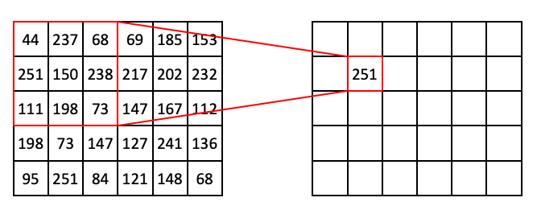

In the above example, the target pixel is located at `(1, 1)` and contains the value `150`. In the 3 x 3 neighborhood surrounding that target pixel, the values are `(44, 237, 68, 251, 150, 238, 111, 198, 73)`. The maximum value in that list is `251`, so position `(1, 1)` of the output array is filled in with `251`.

If we slide the 3 x 3 window one step to the right, we are now targeting `(1, 2)`, which has the value of `238` in our input array. This also happens to be the maximum value in the neighborhood:

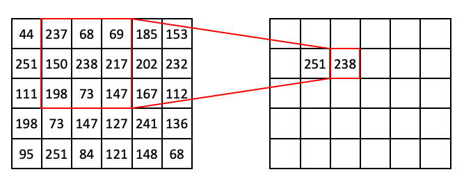

If we extend this process further, we can begin to fill out the row:

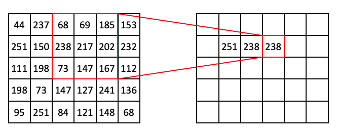

Then:

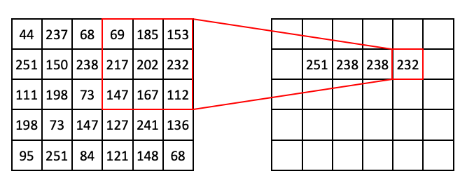

At this point you might notice that, if we use a 3 x 3 window, we can't target pixels on the edge of the image. To get around this problem, we can use a technique called **padding**, where we add extra pixels to the input image. Here is an example of zero padding:

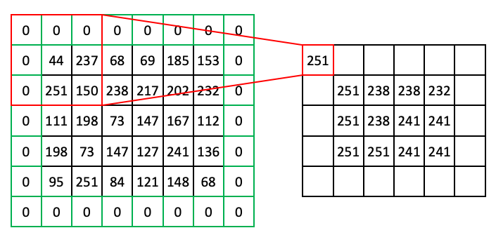

You can imagine other types of padding. Another common pad is 'edge' or 'extend' where the edge pixels just repeat as far as needed to fill the neighborhood.

_Note: Not all filters strictly require padding, but it's a generally useful concept to know, so it is shown here._

Here we went over an example of a Max filter, but you'll see many types of these window-based filters including but not limited to:

* Rank filters such as max, min, and median
* Filters based on descriptive statistics such as mean and standard deviation
* Convolutional filters (more on these later)

Filters have a lot of practical uses in image processing, such as:

* Smoothing out noise (despeckling)
* Expanding light or dark areas
* Highlighting regions of interest such as edges
* Calculating features for machine learning

Let's take a look at how we can use scikit-image to apply filters to our images!

## Filtering images with scikit-image

To begin, we'll start with a grayscale and inverted version of the ABC blocks image.

```python
>>> from skimage import io, transform
>>> from skimage.color import rgb2gray
>>> from skimage.util import img_as_ubyte, invert
>>> 
>>> blocks = io.imread('data/abc_blocks.png')
>>> blocks = transform.rescale(blocks, .5, multichannel=True)
>>> blocks = rgb2gray(blocks)
>>> blocks.shape
(322, 334)
>>> blocks = invert(blocks)
>>> blocks.dtype
dtype('float64')
>>> blocks = img_as_ubyte(blocks)
>>> blocks.dtype
dtype('uint8')
>>> io.imshow(blocks);
```


Now let's take a look at some rank filters.

First, we need to indicate the shape of the neighborhood around each pixel. This is just an array of ones and zeros, where ones indicate pixels to be included in the neighborhood and zeros indicate excluded pixels. This neighborhood indicator is often referred to as a **structuring element**, abbreviated in the scikit-image API as `selem`. In our examples in the beginning of this lesson, we used the shape `(3, 3)`. We can create that fairly easily:

```python
>>> from skimage import morphology
>>>
>>> selem = morphology.square(3)
>>> print(selem)
[[1 1 1]
 [1 1 1]
 [1 1 1]]
```

Using that `selem`, we can apply a Max Filter:

```python
>>> from skimage.filters import rank
>>> 
>>> blocks_max = rank.maximum(blocks, selem)
>>> io.imshow(blocks_max);
```

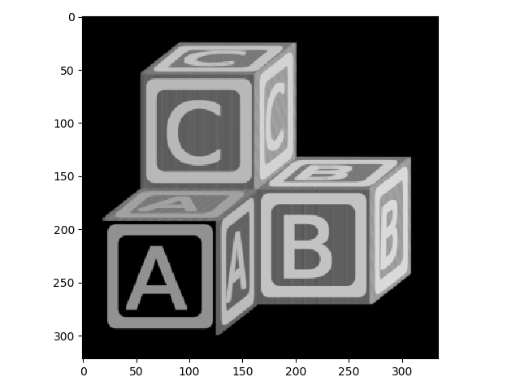

Here you can see that the Max Filter expanded the bright regions of the image into the dark regions. A Min filter does the opposite:

```python
>>> blocks_min = rank.minimum(blocks, selem)
>>> io.imshow(blocks_min);
```

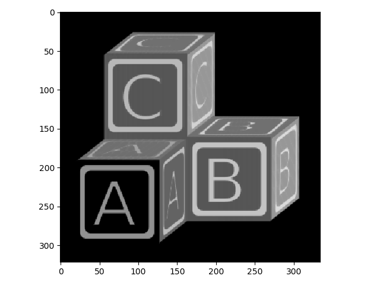

You can see that, compared to the original image, the bright areas have receded.

Now watch what happens when you use a larger structuring element (9 x 9) with these operations:

```python
>>> selem = morphology.square(9)
>>> blocks_max2 = rank.maximum(blocks, selem)
>>> io.imshow(blocks_max2);
```


```python
>>> blocks_min2 = rank.minimum(blocks, selem)
>>> io.imshow(blocks_min2)
```

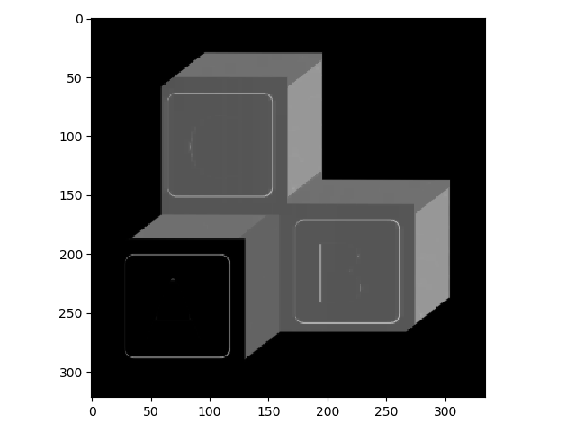

Structuring elements don't necessarily have to be square. For example, here is a disk-shaped structuring element.

```python
>>> selem = morphology.disk(4)
>>> selem.shape
(9, 9)
>>> print(selem)
[[0 0 0 0 1 0 0 0 0]
 [0 0 1 1 1 1 1 0 0]
 [0 1 1 1 1 1 1 1 0]
 [0 1 1 1 1 1 1 1 0]
 [1 1 1 1 1 1 1 1 1]
 [0 1 1 1 1 1 1 1 0]
 [0 1 1 1 1 1 1 1 0]
 [0 0 1 1 1 1 1 0 0]
 [0 0 0 0 1 0 0 0 0]]
```

For this structuring element, rather than taking all of the pixels in a 9 x 9 window, only the pixels that correspond to a `1` in the element would be considered.

Watch how a round element changes the effect of the max filter:

```python
>>> blocks_max3 = rank.maximum(blocks, selem)
>>> io.imshow(blocks_max3)
```

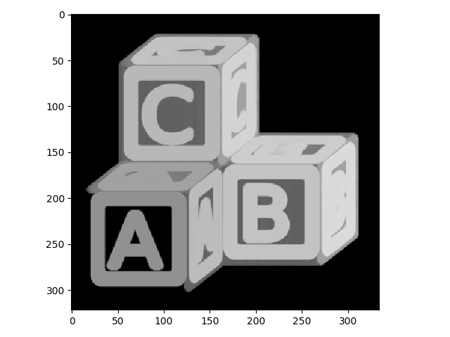

Here you can see that the bright areas grow out in a more rounded way than when using the square-shaped structuring element.

## Convolutional Filters

Filters based on [convolution](https://en.wikipedia.org/wiki/Convolution) are fundamental not only to image processing, but other aspects of [signal processing](https://en.wikipedia.org/wiki/Signal_processing) and [machine learning](https://en.wikipedia.org/wiki/Convolutional_neural_network) as well. It may be worth reading up on the mathematical basis of convolution to better understand what it entails. Here we will discuss only the specific case pertaining to image analysis.

 The basic concept of a convolutional filter is similar to the filters described above. Output image pixels are derived from a mathematical operation on a neighborhood surrounding the corresponding input image pixel. But the nature of the operation is quite different from the previous examples. Each step of a convolution entails the calculation of the [dot product](https://en.wikipedia.org/wiki/Dot_product) between the pixel values in a region of input image and corresponding values in a kernel of equal shape. The choice of the values of the kernel determines the effect of the filter.

Consider the following example, showing only one step of a convolutional filter. We take all of the pixel values of some region of input image, `(44, 237, 68, 251, 150, 238, 111, 198, 73)` and then the corresponding pixel values in our kernel `(1, 1, 1, 1, -8, 1, 1, 1, 1)` and calculate the dot product:

")

So the pixel in the output image that corresponds to the `150` value in the input image will have the value `20`.

With that in mind, let's look at the case of a simple edge detector applied to a simple edge. In the input image below, there is a single vertical edge separating a dark region (all `0`) from a bright region (all `255`).

The kernel we will use for edge detection is called a [Prewitt](https://en.wikipedia.org/wiki/Prewitt_operator) operator and looks like:

```
1 0 -1
1 0 -1
1 0 -1
```

It is important to note here that when we calculate the dot product with this operator, we first flip it along both the horizonal and vertical axes before matching up corresponding values. This has to do with the mathematical basis of the convolution function. In the following examples below, we show the kernel flipped so that it is easier to match up corresponding pixel values.

For regions of all `0`, the dot product will simply be `0`.

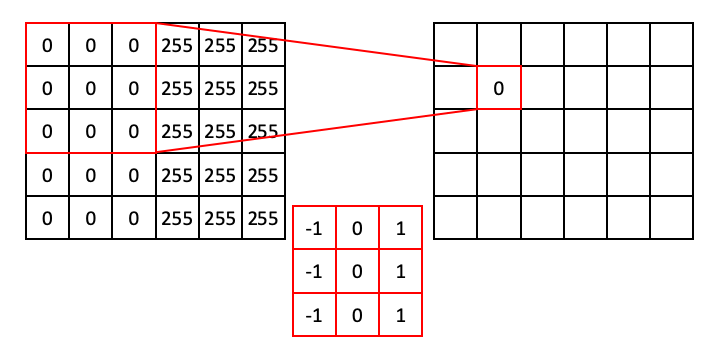

Moving down the column:

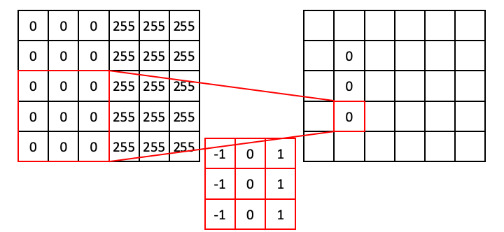

Similarly, for regions where the values are all `255`, the dot product will also be zero (because the positive values resulting from the ones will exactly cancel out the values resulting from the negative ones).

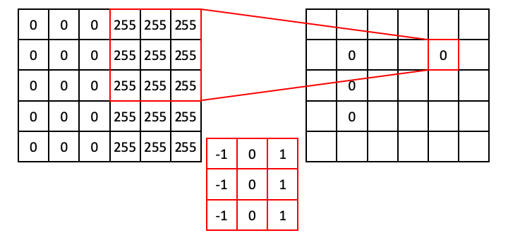

However, the situation is different when the operator straddles an edge. In the next example, the ones align with `255`s, whereas the negative ones align with zeros. This results in a dot product of 765.

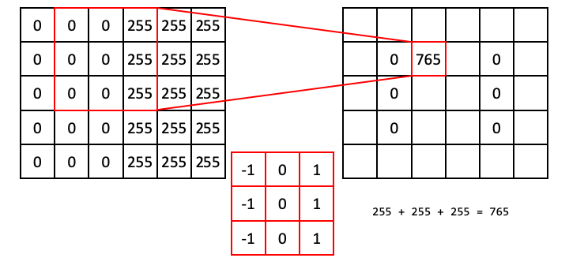

Following this operation all the way through (with [edge padding](https://scikit-image.org/docs/dev/api/skimage.util.html#skimage.util.pad)) produces an output array that shows signal only over the edge in the original image (i.e., a region of high horizontal [gradient](https://en.wikipedia.org/wiki/Image_gradient)), and regions of the input image that are constant result in zeros:

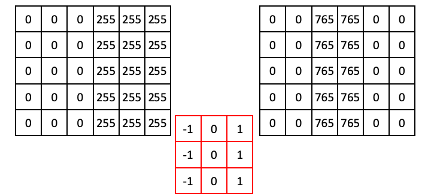

Now that we understand how convolutional filters work, we can try some in `scikit-image`. We'll first try the vertical Prewitt filter example we just showed.

We first use some `numpy` to create the example array:

```python
>>> import numpy as np
>>> 
>>> a = np.zeros((5,6))
>>> a[:, 3:] = 255
>>> print(a)
[[  0.   0.   0. 255. 255. 255.]
 [  0.   0.   0. 255. 255. 255.]
 [  0.   0.   0. 255. 255. 255.]
 [  0.   0.   0. 255. 255. 255.]
 [  0.   0.   0. 255. 255. 255.]]
```

Now for the filter:

```python
>>> from skimage import filters
>>> 
>>> edge = filters.prewitt_v(a)
>>> print(edge)
[[  0.   0. 255. 255.   0.   0.]
 [  0.   0. 255. 255.   0.   0.]
 [  0.   0. 255. 255.   0.   0.]
 [  0.   0. 255. 255.   0.   0.]
 [  0.   0. 255. 255.   0.   0.]]
```

You'll notice that this output is different from our example. This is because `scikit-image` knows that we started with a `uint8` image, and `765` is out of the range of values that are acceptable for that data type. The pixel intensities were thus rescaled, athough the output array is still `float64`. This is a good example of why you always want to explore the behavior of code before you use it in your analysis!

To better appreciate the utility of this filter, we can apply it to our block image:

```python
>>> block_v_edges = filters.prewitt_v(blocks)
>>> io.imshow(block_v_edges)
```

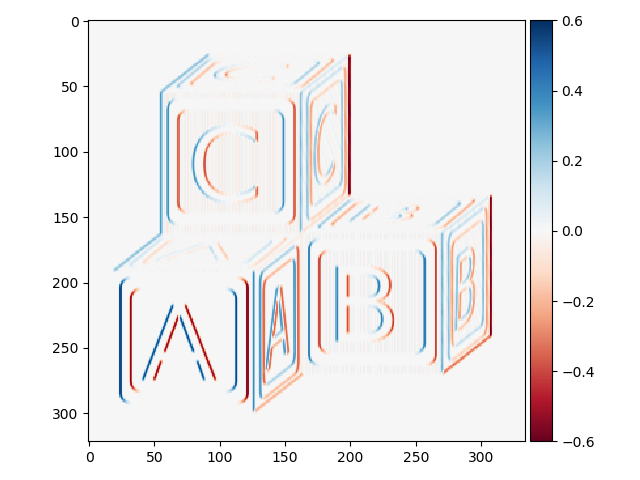

You can see that our edge detector did a pretty good job of detecting edges with a vertical orientation. The floating point values are positive where the edge is a transition from a relatively darker area to a lighter area, and negative when transitioning from light to dark.

We can similarly find all horizontal edge:

```python
>>> block_h_edges = filters.prewitt_h(blocks)
>>> io.imshow(block_h_edges)
```

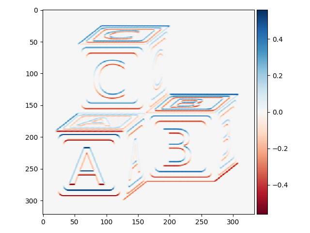

Or all edges:

```python
>>> block_edges = filters.prewitt(blocks)
>>> io.imshow(block_edges)
```

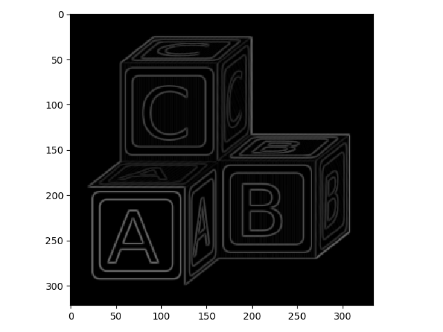

Note here that the color scheme is different - there are no negative values because `filters.prewitt` does not capture orientation information.

Another nice edge filter is the [Laplacian](https://en.wikipedia.org/wiki/Laplace_operator) filter:

```python
>>> block_edges2 = filters.laplace(blocks)
>>> io.imshow(block_edges2)
```

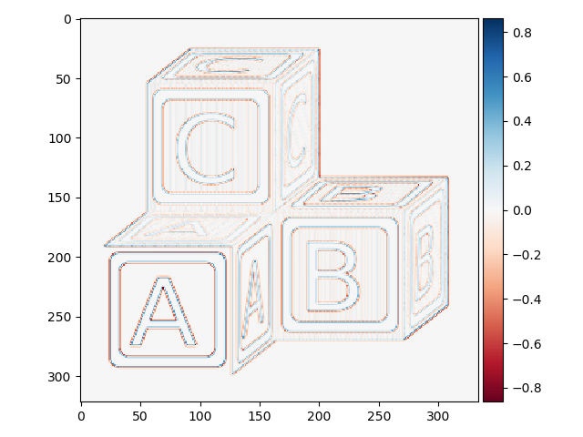

This one looks a little strange. Let's zoom in to better understand what is going on:

```python
>>> io.imshow(block_edges2[50:75, 50:75])
```

")

With this filter, edges are indicated by a [zero crossing](https://en.wikipedia.org/wiki/Zero_crossing) between bands of negative and positive values.

One problem with Laplacian filters is that they are highly sensitive to noise - note that you can see plenty of "edge" signal in the zoomed-in image above. To get around this, a smoothing filter (e.g., a Gaussian filter; see below) is usually applied to images before the Laplacian filter.

## Exercise

1. Convert the astronaut image (`skimage.data.astronaut`) to grayscale and highlight edges in the picture.
2. Thicken the edges to make them stand out better.

## Gaussian filtering

The last filter we will cover in this lesson is probably the most commonly used tool in image analysis, the Gaussian filter. This filter entails convolving a two-dimensional Guassian function kernel with your input image.

Here is an example of a `(21, 21)` Gaussian kernal with a `sigma` value of 3:

```python
>>> from scipy.signal import gaussian as gk
>>> 
>>> gaussian_2d = gk(21, 3)[:, None] * gk(21, 3)[None, :]
>>> io.imshow(gaussian_2d);
```

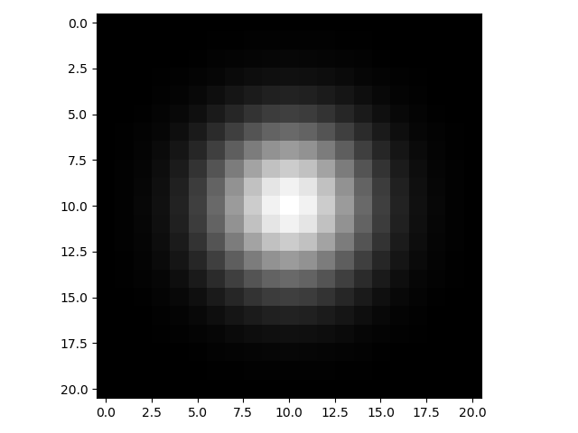

If you were to plot the intensity of pixels along a line intersecting the center point of the kernel, it would look like the classic bell-shaped Gaussian curve:

```python
>>> import matplotlib.pyplot as plt
>>> 
>>> plt.plot(gaussian_2d[:, 10])
```

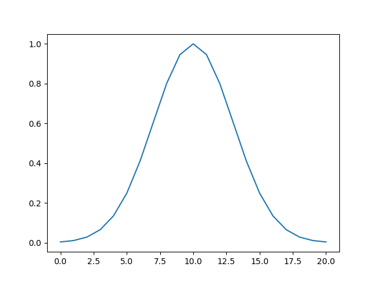

Gaussian filters are [low-pass filters](https://en.wikipedia.org/wiki/Low-pass_filter), which means they serve to blur your image. This will smooth out noise. Larger `sigma` values for the Gaussian kernel result in more blurring:

```python
>>> blocks_blur3 = filters.gaussian(blocks, sigma=3)
>>> io.imshow(blocks_blur3);
```

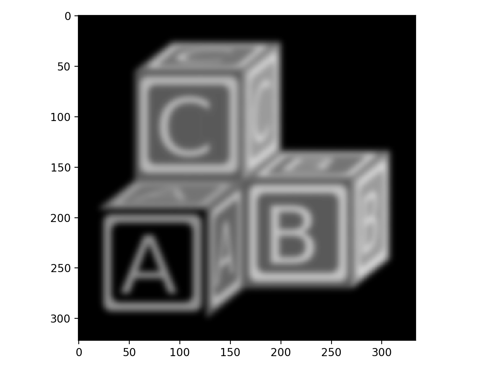

```python
>>> blocks_blur10 = filters.gaussian(blocks, sigma=10)
>>> io.imshow(blocks_blur10)
```


To show why blurring is so important, let's take a look at some real data. These are stained nuclei in a brain slice:

```python
>>> cells = io.imread('data/cells.tif')
>>> io.imshow(cells);
```

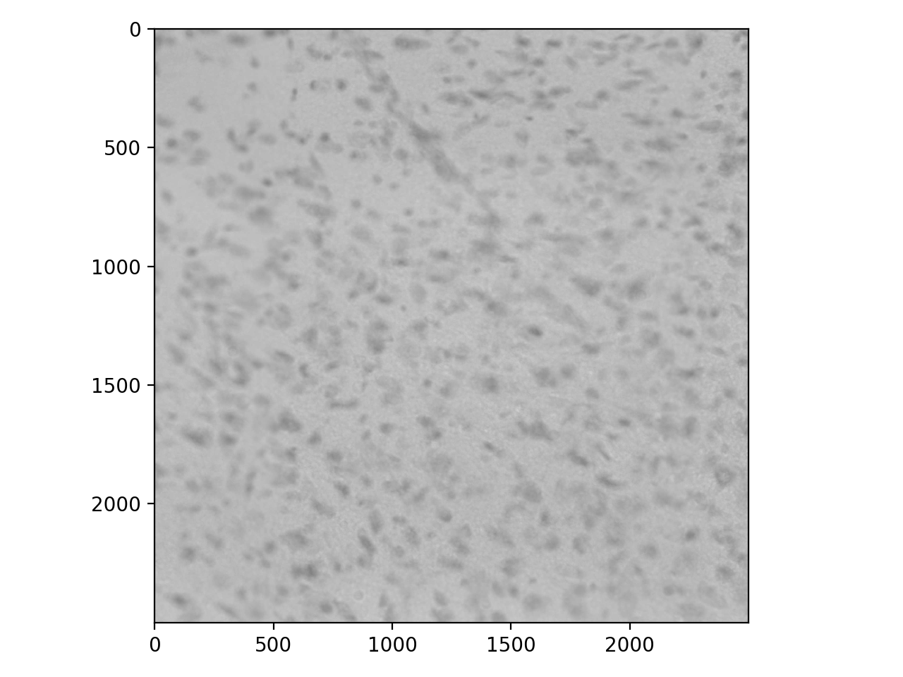

We usually want bright signal on a dark background, so invert:

```python
>>> cells_i = invert(cells)
>>> io.imshow(cells_i);
```

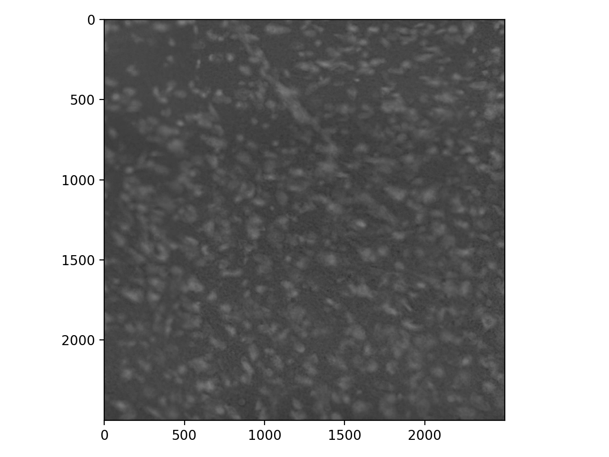

Now, to find the edges of our nuclei, we might apply a Prewitt filter. But there is a lot of noise in this image, so the result is unsatisfactory:

```python
>>> cells_prewitt = filters.prewitt(cells_i)
>>> io.imshow(cells_prewitt);
```

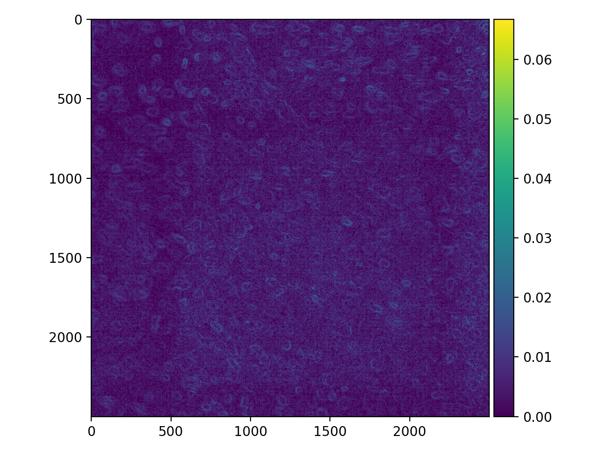

The noise overwhelms the image. We can fix our edge detector by first applying some guassian blur.

```python
>>> cell_gaussian = filters.gaussian(cells_i, sigma=8)
>>> io.imshow(cell_gaussian);
```

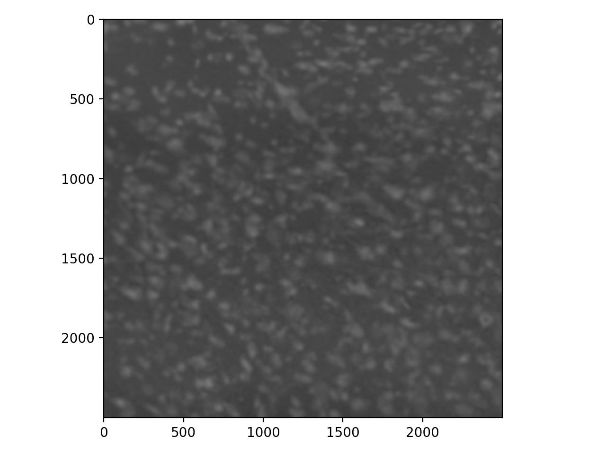

```python
>>> cells_pog = filters.prewitt(cell_gaussian)
>>> io.imshow(cells_pog);
```

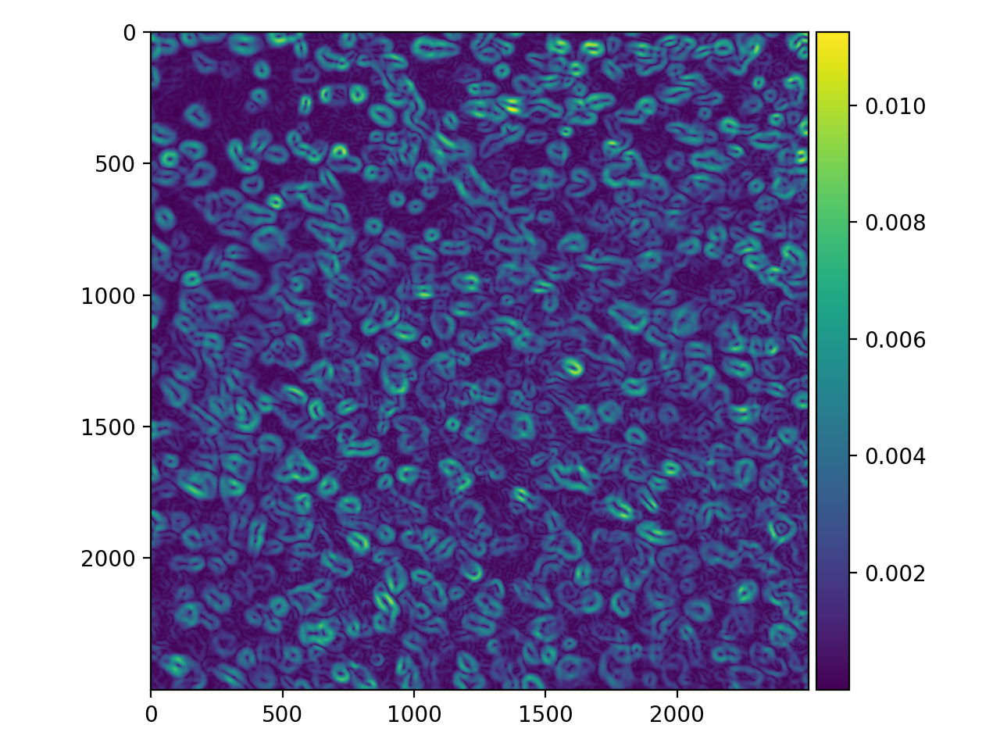

This is certainly an improvement! The "edges" are a bit thick and somewhat blurry themselves, but there are some tricks for refining them (that we won't cover here).

## Exercise

1. Apply a Laplacian filter following a Gaussian blur and examine the results. Adjust the size of the `sigma` of the Gaussian. At what `sigma` value do you find the strongest response for individual nuclei?
