# Part 3 - Morphology and Segmentation

## Image thresholding in scikit-image

Many analyses in image processing begin with separating foreground from background. This is called binarization or thresholding and usually entails setting all values above a certain value to `1` (or `True`) and all other values to `0` (or `False`). Once an image is binarized, there are several techiniques for refining the foreground and background signals based on [Morphological Operations](https://en.wikipedia.org/wiki/Mathematical_morphology).

To demonstrate the power of morphological operations in image processing, let's begin with a binarized version of `blocks.jpeg`.

```python
>>> from skimage import io
>>> from skimage.color import rgb2gray
>>> from skimage.util import invert, img_as_ubyte
>>> 
>>> blocks = io.imread('data/abc_blocks.png')
>>> blocks = rgb2gray(blocks)
>>> blocks = invert(blocks)
>>> blocks_thresh = blocks > 0.7
>>> io.imshow(img_as_ubyte(blocks_thresh));
```

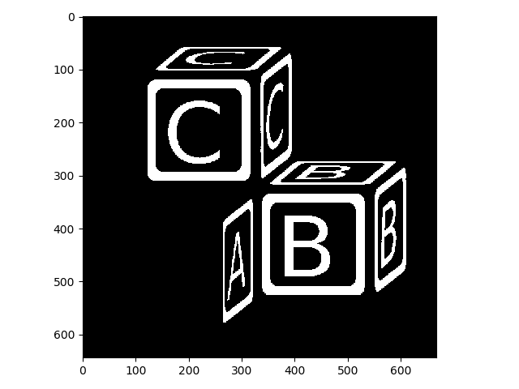

Here we thresholded simply by evaluating `blocks > 0.7`. This created a boolean array, which we then converted back to `uint8` for display purposes:

```python
>>> blocks_thresh = blocks > 0.7
>>> blocks_thresh.dtype
dtype('bool')
>>> blocks_thresh[88:92, 200:204]
array([[ True,  True,  True,  True],
       [False,  True,  True,  True],
       [False, False, False, False],
       [False, False, False, False]])
>>> img_as_ubyte(blocks_thresh[88:92, 200:204])
array([[255, 255, 255, 255],
       [  0, 255, 255, 255],
       [  0,   0,   0,   0],
       [  0,   0,   0,   0]], dtype=uint8)
```

`scikit-image` has a number of methods for setting threshold values automatically for an image, which is important because manually adjusting that value would quickly become tedious at scale. You can test out all automatic thresholding methods with `filters.try_all_threshold`:

```python
>>> from skimage import filters
>>> 
>>> filters.try_all_threshold(blocks);
skimage.filters.thresholding.threshold_isodata
skimage.filters.thresholding.threshold_li
skimage.filters.thresholding.threshold_mean
skimage.filters.thresholding.threshold_minimum
skimage.filters.thresholding.threshold_otsu
skimage.filters.thresholding.threshold_triangle
skimage.filters.thresholding.threshold_yen
```

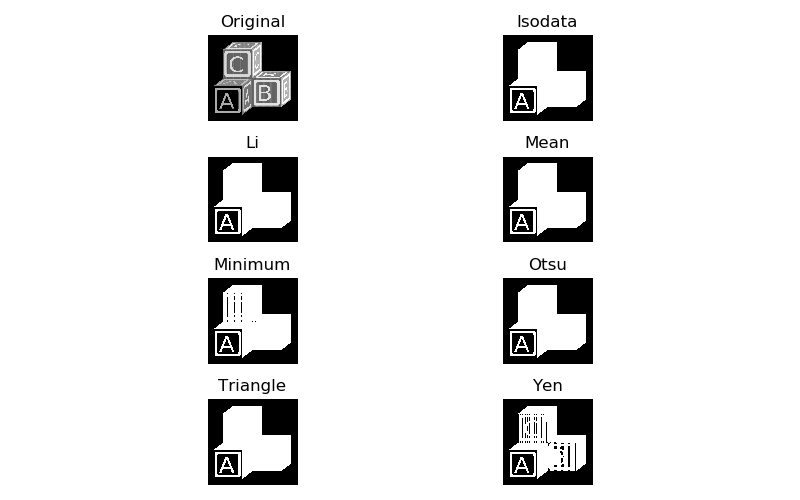

Depending on what exactly you are trying to separate, one, several, or none of these thresholding algorithms will do the trick. If our goal is to separate out all of the lettering from the rest of the image, we will need to try something else. This is because the letter **A**, while brighter than the surrounding blockface, is actually less bright than the background on the rest of the block faces, so no single threshold value is appropriate. In this case, one can try local thresholding:

```python
>>> nib_thresh_val = filters.threshold_niblack(blocks, 41, .001)
>>> blocks_nib = blocks > nib_thresh_val
>>> io.imshow(img_as_ubyte(blocks_nib))
```

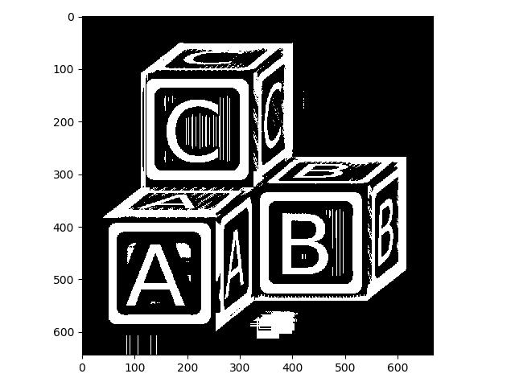

The Niblack method for locally adaptive thresholding we just used takes a couple of parameters, which were manually tuned for this particular image, but should work reasonably well for similar images. Unfortunately, in this case, some regions come up that are clearly not what we want. These are artifacts of the algorithm.

The Li method for automatic thresholding that we tried above found a lot of true background but failed to threshold appropriately within the blocks. Here, we can take a simple intersection of the two thresholded images to clean things up substantially:

```python
>>> li_thresh_val = filters.threshold_li(blocks)
>>> blocks_li = blocks > li_thresh_val
>>> letters = blocks_li & blocks_nib
>>> io.imshow(img_as_ubyte(letters));
```


This is improved. Nonetheless, there are still some artifacts present, and there are regions that are appropriately thresholded but not of interest (e.g., the thin lines on the block faces). We might be able to clean some of these issues up with morpholgical operations!

## Basic morphological operations

In this lesson, we will cover the basic operations of mathematical morphology: dilation, erosion, opening and closing. These operations function very similarly to the rank filters we covered in the previous lesson. So every operation depends on the definition of a structuring element (`selem`). In the next example image, our structuring element will be:

```code
0 1 0
1 1 1
0 1 0
```

For clarity, we'll use a very small example image and show the structuring element as in the filtering example of the previous lesson:

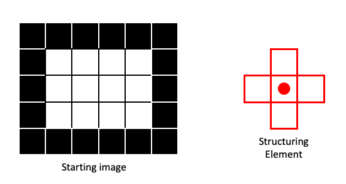

### Erosion

Erosion is basically a Min filter applied to a binary image. This means that output pixel will be `0` (`False`), if any part of the structuring element centered on the corresponding input pixel contains a `0`. In this next example, two of the four pixels within the structuring element in the input image contain `0`, so the output pixel gets a `0`:

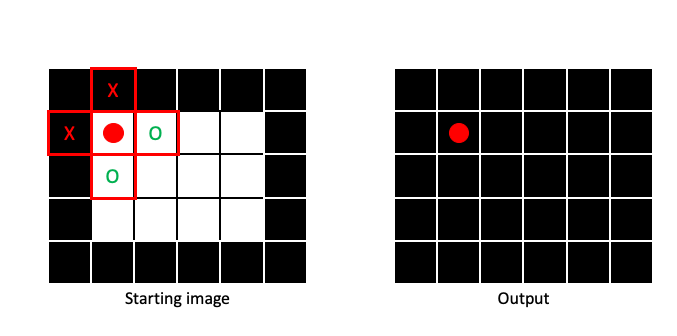

It is only when the entire structuring element is filled with `1` that the output pixel will be `1`:


By sliding the structuring element across the entire image (padding when necessary), we can create an output image that has been eroded:

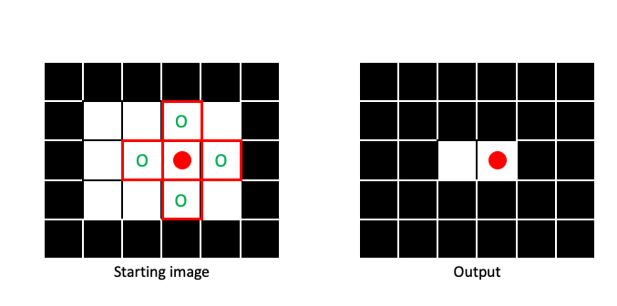

Erosion makes regions of `1` pixels (foreground) smaller, in a manner dictated by the size and shape of the structuring element:

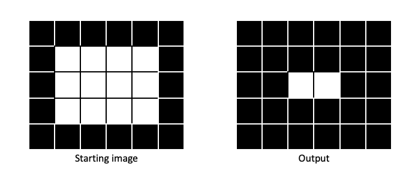

### Dilation

Dilation is the opposite of erosion, a Max filter applied to a binary image. It is only when no part of the structuring element covers a `1` that a `0` is assigned to the output image:

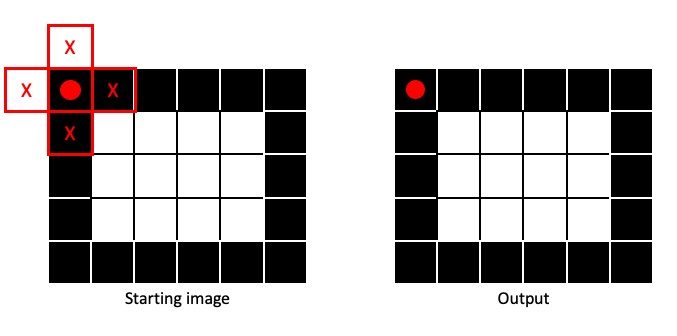

If any part of the structuring element covers a `1` in the input image, the output pixel gets a `1`:

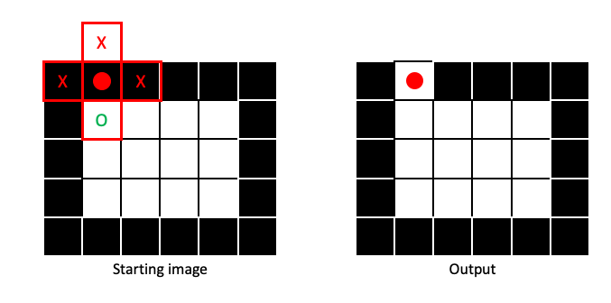

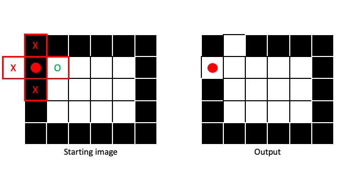

Dilation will make regions of `1` pixels (foreground) larger, in a manner dictated by the size and shape of the structuring element:


### Opening and closing

Opening and closing are based on dilation and erosion.

- **Opening**: One round of erosion followed by dilation. Tends to remove small patches of `1` pixels (i.e., small foreground objects).

- **Closing**: One round of dilation followed by erosion. Tends to remove small patches of `0` pixels (i.e., small holes in foreground).

Opening and closing both tend to smooth the edges between foreground and background, in a manner dictated by the size and shape of the structuring element.

Let's apply some morphological operations to our `letters` image. First we need to create a structuring element:

```python
>>> from skimage import morphology
>>> 
>>> selem = morphology.diamond(1)
>>> print(selem)
[[0 1 0]
 [1 1 1]
 [0 1 0]]
```

Here is the effect of dilation with this `selem` on `letters`:

```python
>>> letters_dil = morphology.dilation(letters, selem)
>>> io.imshow(img_as_ubyte(letters_dil));
```

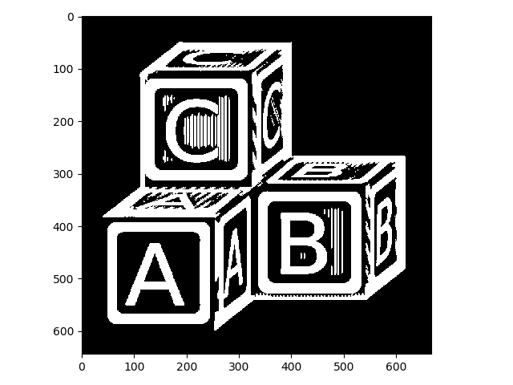

Compared to the image above, the white lines are thicker. This isn't quite what we want.

Applying erosion to the original image produces the opposite effect:

```python
>>> letters_ero = morphology.erosion(letters, selem)
>>> io.imshow(img_as_ubyte(letters_ero));
```

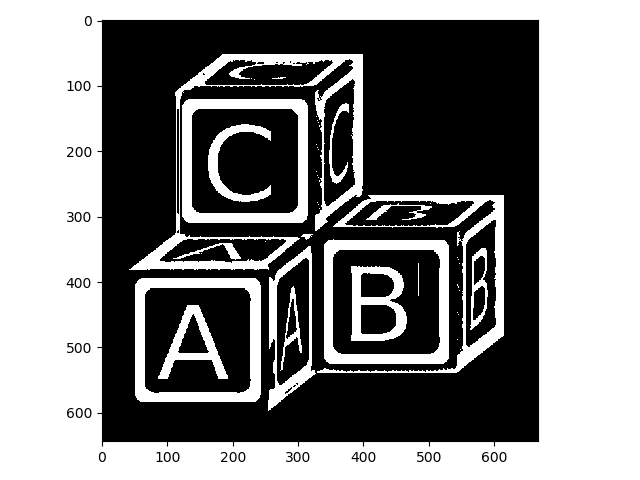

That got rid of a lot of our unwanted foreground, but it thinned out our foreground as well. Now let's look at opening and closing:

Closing:

```python
>>> letters_clo = morphology.closing(letters, selem)
>>> io.imshow(img_as_ubyte(letters_clo));
```

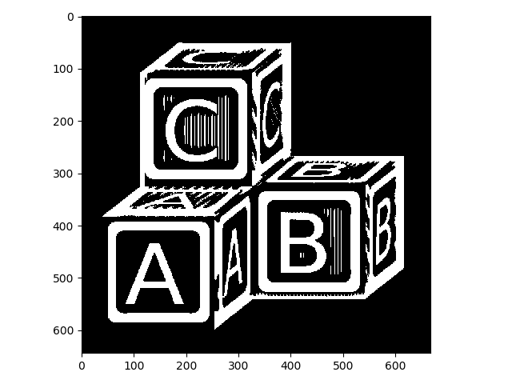

Remember that closing tends to get rid of small holes in the foreground, so in retrospect we should have known that wouldn't have helped.

Opening gets rid of small/thin foreground objects:

```python
>>> letters_op = morphology.opening(letters, selem)
>>> io.imshow(img_as_ubyte(letters_op));
```

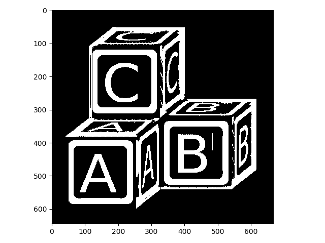

That looks much better! Let's stop there (feel free to try some different structuring elements or chain together a few operations to improve it).

## Skeletonizing

[Skeletonizing](https://en.wikipedia.org/wiki/Morphological_skeleton) is another useful technique whereby the input binary image is successively eroded in a controlled way, until all foreground objects are a single pixel in width. `skimage` also has a nice function for skeletonizing:

```python
>>> letters_skeleton =  morphology.skeletonize(letters_op)
>>> io.imshow(img_as_ubyte(letters_skeleton));
```


**WARNING**: When you have single-pixel-width foreground objects in your image, they won't look correct in display, because of [aliasing](https://en.wikipedia.org/wiki/Aliasing). Watch what happens when we zoom in on the A block, for example:

```python
>>> io.imshow(img_as_ubyte(letters_skeleton[350:600, 50:340]));
```

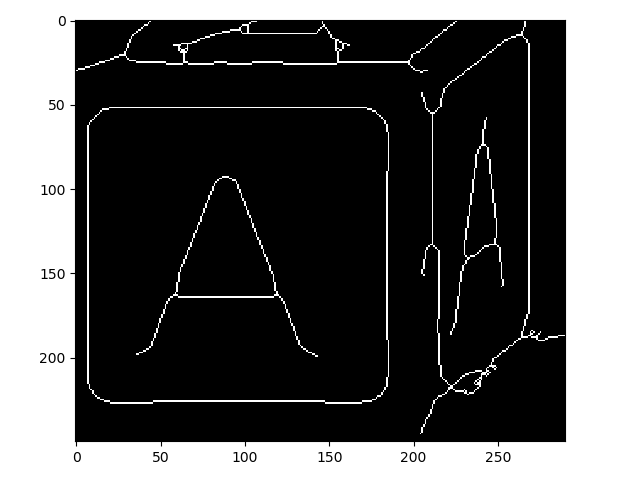

So you can see that this did work as advertised!

Skeletonizing is generally used for modeling objects in your image or for direct measurement purposes.

## Pixel connectivity

In the first part of this lesson, we saw how you can partition an image into foreground and background. This partitioning is a form of [image segmentation](https://en.wikipedia.org/wiki/Image_segmentation). Often, we want to segment not just foreground from background, but also different objects from one another.

One way to separate foreground into multiple, separate objects is by [pixel connectivity](https://en.wikipedia.org/wiki/Pixel_connectivity). Here, we look for regions of foreground pixels that are "touching" and assign unique values for each separate group.

For two-dimensional images, we usually consider either A) the four pixels that are 1 step away from the target pixel (1-connectivity in `skimage`) or B) the four 1-step pixels plus the four pixels that are 1 diagonal "step" away from the target pixel (2-connectivity in `skimage`):


Note that you will often see *1-connectivity* referred to as *4-connected* (for the 4 neighbor pixels) and *2-connectivity* referred to as *8-connected* (for the 8 neighbor pixels) in other contexts/literature. Just be aware of these differences.

To see how connectivity can effect segmentation, lets look at a couple of examples. In the first example the 1-connectivity zone can not simultaneously cover the two foreground squares:

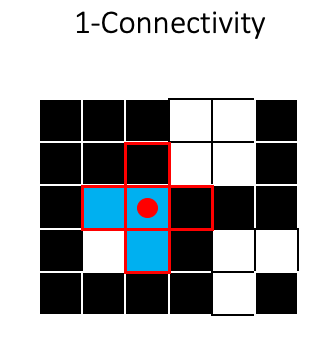

So the two squares would be assigned as separate objects, indicated here by different colors:

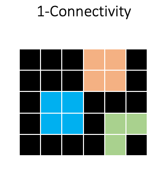

In `skimage`, these segmentations are represented as an integer array:

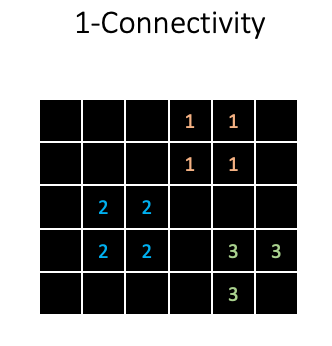

So background receives a `0`, and all foreground objects receive a unique integer value for each pixel.

Using 2-connectivity will produce a different result, because the two squares will be considered as one object:

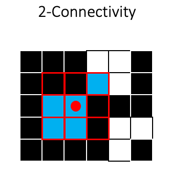

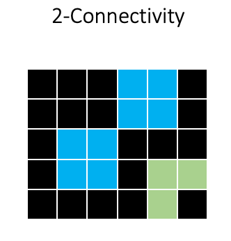

Now let's see how this would look when applied to our `letters_op` image. First we will use `skimage.measure.label` with 1-connectivity:

```python
>>> from skimage import measure
>>> 
>>> letters_labels = measure.label(letters_op, connectivity=1)
>>> io.imshow(letters_labels);
```

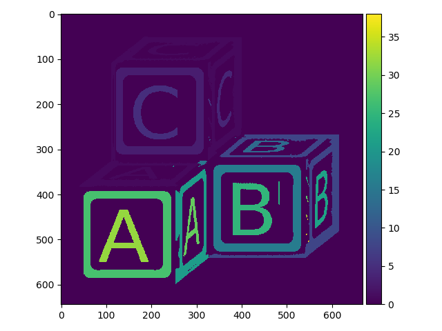

We can easily see that this did *something*, but the default color mapping used to display the image is not helping us much. Here is what a zoomed in region of the array looks like:

```python
>>> print(letters_labels[162:172, 116:128])
[[0 1 1 1 0 0 3 3 3 3 3 3]
 [0 1 1 1 0 0 3 3 3 3 3 3]
 [0 1 1 1 0 0 3 3 3 3 3 3]
 [0 1 1 1 0 0 3 3 3 3 3 3]
 [0 1 1 1 0 0 3 3 3 3 3 3]
 [0 1 1 1 0 0 3 3 3 3 3 3]
 [0 1 1 1 0 0 3 3 3 3 3 3]
 [0 1 1 1 0 0 3 3 3 3 3 3]
 [0 1 1 1 0 0 3 3 3 3 3 3]
 [0 1 1 1 0 0 3 3 3 3 3 3]]
```

So different objects were indeed assigned different integer values, but the default `io.imshow` function is not helping us to visualize the different objects much.

`skimage` has a nice visualization function specifically designed to look at segmentations (`color.label2rgb`):

```python
>>> from skimage.color import label2rgb
>>> io.imshow(label2rgb(letters_labels));
```

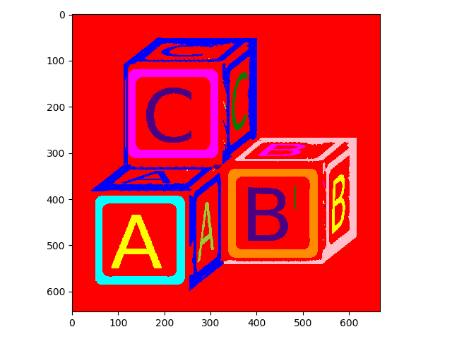

Now it is easier to see the different objects.

What about 2-connectivity?

```python
>>> letters_labels2 = measure.label(letters_op, connectivity=2)
>>> io.imshow(label2rgb(letters_labels2));
```

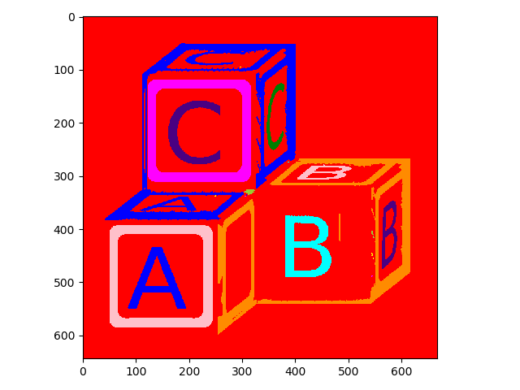

Here it is easy to see that objects that were considered separate with 1-connectivity have been combined with 2-connectivity.

Once you have a nicely labeled image, there are a few tricks you can pull off with `numpy`. For example, you can easily count the total number objects:

```python
>>> letters_labels.max()
38
>>> letters_labels2.max()
23
```

You can find the area of each object in pixels:

```python
>>> import numpy as np
>>>
>>> for obj in range(0, letters_labels2.max()):
...     size = len(np.where(letters_labels2 == obj)[0])
...     print(f'object id: {obj} \t size: {size}')
```

```code
object id: 0 	 size: 334590
object id: 1 	 size: 21722
object id: 2 	 size: 5
object id: 3 	 size: 11970
object id: 4 	 size: 1180
object id: 5 	 size: 3672
object id: 6 	 size: 18479
object id: 7 	 size: 5
object id: 8 	 size: 1219
object id: 9 	 size: 130
object id: 10 	 size: 12080
object id: 11 	 size: 5
object id: 12 	 size: 5
object id: 13 	 size: 5
object id: 14 	 size: 5
object id: 15 	 size: 1732
object id: 16 	 size: 152
object id: 17 	 size: 5393
object id: 18 	 size: 12070
object id: 19 	 size: 31
object id: 20 	 size: 1400
object id: 21 	 size: 4317
object id: 22 	 size: 20
```

But can also use `skimage.measure.regionprops` to more simply calculate a large number of [parameters](https://scikit-image.org/docs/stable/api/skimage.measure.html#regionprops) for each object:

```python
>>> letters_props = measure.regionprops(letters_labels2)
>>> len(letters_props) # Number of detected objects
23
>>> letters_props[0].label # Label of the first object
1
>>> letters_props[0].area # Area of first object in pixels
21722
>>> letters_props[0].centroid # Subpixel location of object centroid
(208.9023570573612, 254.6107632814658)
>>> letters_props[0].bbox # Coordinates describing object bounding box
(52, 41, 384, 400)
```

## Exercise

1. Create a new image from the "coins" example in scikit-image

    ```python
    from skimage import data
    coins = data.coins()
    ```

Now write something to automatically count the number of coins and output their size. This does not have to be perfect! You can do a decent job using only what you have learned in this workshop.

## Finally

If you complete the coin exercise without too much trouble, try it again with data/cells.tif!
Using only what we have learned in this workshop, can you write something to calculate cell counts?
